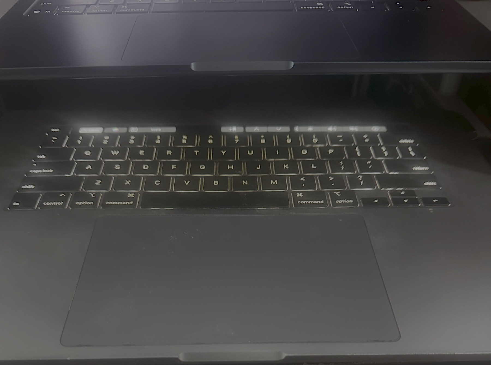

# T2 Keyboard Backlight Bypass ✨



Utility for setting the keyboard backlight to half brightness on a 2019 16-inch Intel MacBook Pro (`MacBookPro16,1`) without an ambient-light sensor or in `headless mode`.

It sends feature reports to the T2 `Touch Bar Backlight` HID interface. It does not repair display hardware.

## Requirements

* macOS on `MacBookPro16,1`
* Xcode Command Line Tools
* Administrator access

Verify the model:

```bash
system_profiler SPHardwareDataType | grep 'Model Identifier'
```

Expected:

```text
Model Identifier: MacBookPro16,1
```

Stop if the identifier differs.

## Build

```bash
clang -fobjc-arc \
  -framework Foundation \
  -framework IOKit \
  t2-kbdlight.m \
  -o t2-kbdlight
```

## Run

```bash
sudo ./t2-kbdlight
```

Expected output:

```text
power-off report: 0x0
brightness report: 0x0
power report: 0x0
```

The keyboard backlight should turn on at half brightness.

## Install

```bash
sudo install -m 755 t2-kbdlight /usr/local/bin/t2-kbdlight
sudo t2-kbdlight
```

## Keep it glowing after sleep

Install the included LaunchDaemon:

```bash
sudo install -m 644 local.t2-kbdlight.plist /Library/LaunchDaemons/local.t2-kbdlight.plist
sudo launchctl bootstrap system /Library/LaunchDaemons/local.t2-kbdlight.plist
```

The daemon listens for wake notifications, waits 250 milliseconds for the T2 bridge, and retries for roughly five seconds. A five-minute fallback handles unexpected resets.

Check your tiny lighting technician:

```bash
sudo launchctl print system/local.t2-kbdlight
sudo tail -n 20 /var/log/t2-kbdlight.log
```

## Limitations

* Supports only the verified `MacBookPro16,1` HID interface.
* Sets half brightness only.
* Shares the HID interface with macOS instead of seizing exclusive access.
* Uses an undocumented protocol and may break after updates.
* Does not repair LEDs, cables, connectors, power paths, or display hardware.
* Successful reports confirm interface acceptance, not physical hardware function.

## Protocol

| Property          |    Value |
| ----------------- | -------: |
| USB vendor        | `0x05ac` |
| USB product       | `0x8102` |
| Vendor usage page | `0xff00` |
| Usage             |     `15` |

Reports:

| Report | Purpose                     |
| ------ | --------------------------- |
| `0x01` | Sets brightness to `30/60`  |
| `0x03` | Powers on the keyboard LEDs |

The protocol was cross-checked against the T2 Linux [`apple-ib-drv`](https://github.com/t2linux/apple-ib-drv/pull/4) implementation for `MacBookPro16,1`.

Use only on the verified hardware.
